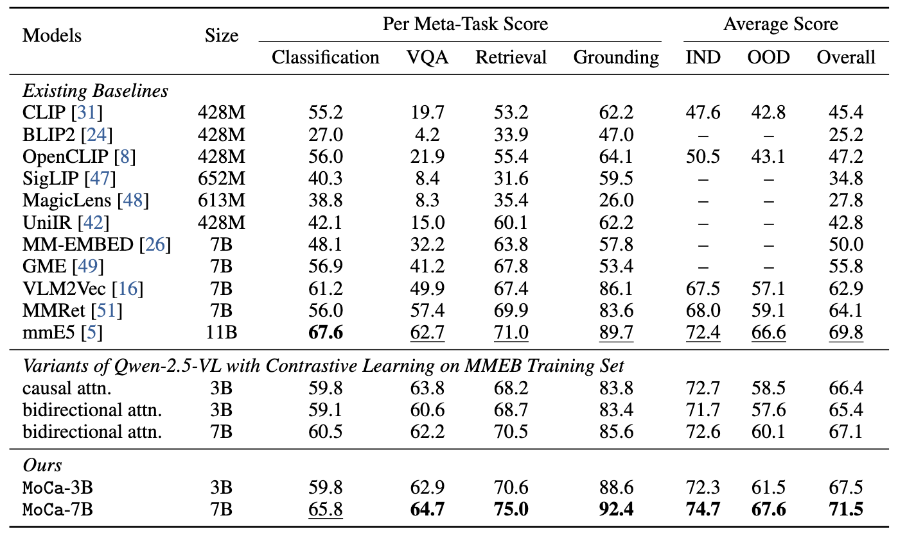
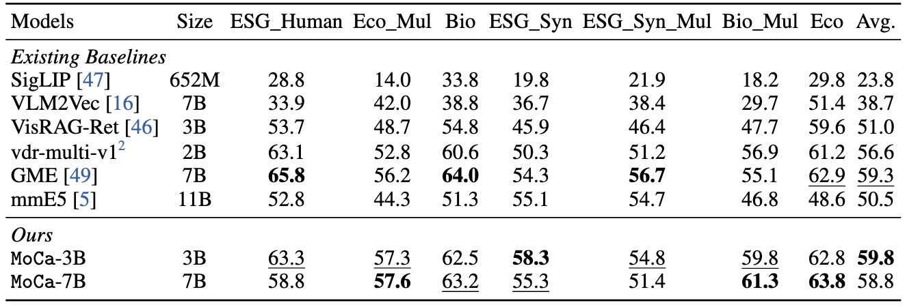

# MoCa: Modality-aware Continual Pre-training Makes Better Bidirectional Multimodal Embeddings

This repo presents the **code and scripts** for `MoCa-Qwen25VL` series of **multimodal embedding models**.

[🏠 Homepage](https://haon-chen.github.io/MoCa/) | [🤖 MoCa-Qwen25VL-7B](https://huggingface.co/MoCa/MoCa-Qwen25VL-7B) | [🤖 MoCa-Qwen25VL-3B](https://huggingface.co/MoCa/MoCa-Qwen25VL-3B) | [💻 Code](https://github.com/haon-chen/MoCa) | [📄 Arxiv]() | [📕 PDF]()

**Highlights**
- SOTA performance on MMEB (General Multimodal) and ViDoRe V2 (Document Retrieval).
- Supports texts, images, and interleaved input.
- Generalize on out-of-distribution data well due to innovative methods.
  - Continually pre-trained on 30B interleaved high quality data with modality-aware reconstruction objectives.
  - Contrastive fine-tuning on diverse data spanning long-form query-document pairs, curated multimodal pairs, and real-world text pairs.

---

## Updates

- **2025‑06‑10:** Initial release – paper, training scripts, checkpoints, and evaluation notebooks.

## Quick Start

### Setup

```
pip install -r requirements.txt
pip install flash-attn==2.5.8
```

### Inference
See scripts in https://huggingface.co/mmembed/MoCa-Qwen25VL-3B and https://huggingface.co/mmembed/MoCa-Qwen25VL-7B.

### Training and Evaluation

- Preparation

```
bash scripts/prepare_images.sh
```

This script will download images for Heterogeneous Contrastive Learning from [MoCa CL Pairs](https://huggingface.co/datasets/MoCa/mmE5-MMEB-hardneg), [mmE5 Synthetic Dataset](https://huggingface.co/datasets/MoCa/mmE5-synthetic), and [MMEB-eval](https://huggingface.co/datasets/TIGER-Lab/MMEB-eval).

**Caution:** This could take a while as the images are large in size. Make sure you have enough disk space (at least 1T).

We have provided example scripts in the `scripts/` directory to help you get started with training and evaluation.

- Continual Pre-training
```
bash scripts/cpt_train.sh
```
**Caution:** Calculating statistics for batching the cpt data could takes a while. However, this process is only needed once and the stats will be saved in the `${DATA_DIR}/cache/stats` directory.
- Contrastive Learning
```
bash scripts/cl_train.sh
```
- Test MMEB
```
bash scripts/eval_full.sh
```
- Test ViDoRe-v2

1. Install vidore-benchmark package following [this repo](https://github.com/illuin-tech/vidore-benchmark).

2. Move `__init__.py` and `mmeb_qwen25_retriever.py` from `/evaluation/vidore_benchmark/` to the vidore-benchmark repo (`src/vidore_benchmark/evaluation`).

3. Run
```
bash scripts/eval_vidore.sh
```

You can also use `demo.py` to embed your own text and images.
```
python demo.py
```

## Experimental Results
MoCa achieves SOTA performance on MMEB benchmark.



MoCa surpasses several strong baselines on ViDoRe-v2 benchmark.




## Acknowledgement
Our code builds upon **mmE5**, **VLM2Vec**, and **Qwen‑2.5‑VL**.

## Citation
```bibtex
@article{xxx,
  title={MoCa: Modality-aware Continual Pre-training Makes Better Bidirectional Multimodal Embeddings},
  author={Chen, Haonan and Liu, Hong and Luo, Yuping and Wang, Liang and Yang, Nan and Wei, Furu and Dou, Zhicheng},
  journal={arXiv preprint arXiv:250xxxx},
  year={2025}
}
```